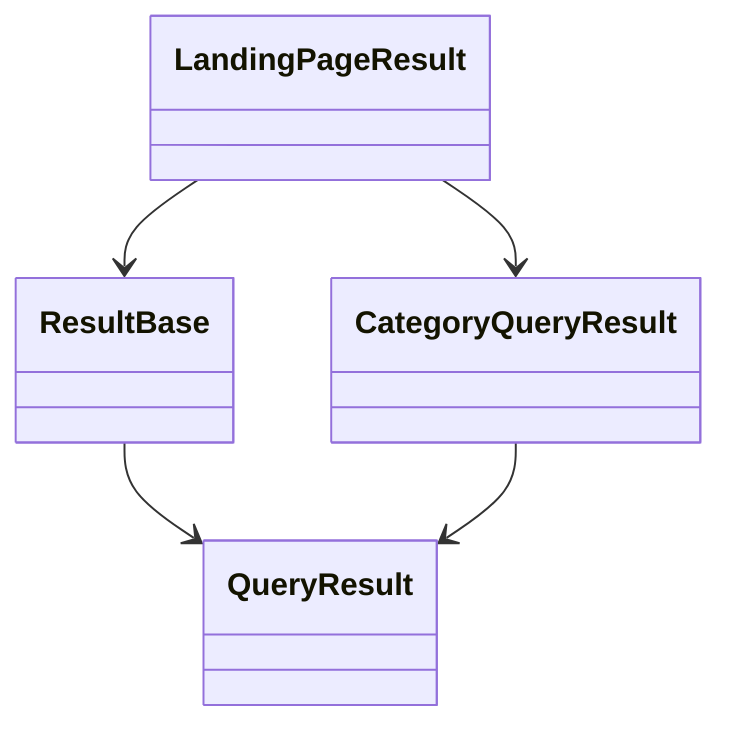

# Resolver

With version 3.12.3. of quarkus.platform, the schema is generated

http://localhost:8080/q/dev-ui/io.quarkus.quarkus-smallrye-graphql/graphql-schema

### Typegraph

```mermaid
classDiagram

LandingPageResult --> CategoryQueryResult
LandingPageResult --> ResultBase

ResultBase --> QueryResult
CategoryQueryResult --> QueryResult
```

